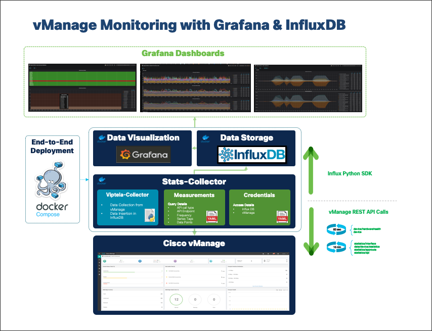

# **Cisco Viptela Monitoring w/ Grafana & Influx DB**

## Table of Contents <!-- omit in toc -->

- [**Cisco Viptela Monitoring w/ Grafana & Influx DB**](#cisco-viptela-monitoring-w-grafana--influx-db)
  - [**1. Overview**](#1-overview)
  - [**2. Installation**](#2-installation)

## **1. Overview**

-----

-----

By default, 6 dashboards will be provisioned during the initial deployment of the Grafana container:

| Dashboard Name            | vManage API Endpoint                                | Frequency   |
|---------------------------|-----------------------------------------------------|-------------|
| DeviceHardwareHealth      | device/hardwarehealth/detail                        | 60 seconds  |
| DeviceSummary             | device                                              | 60 seconds  |
| DeviceInterfaceStatistics | statistics/interface                                | 600 seconds |
| DeviceSystemStatusStats   | data/device/statistics/devicesystemstatusstatistics | 600 seconds |
| AppRouteStatsStatistics   | statistics/approute                                 | 600 seconds |
| DPIStatistics             | statistics/dpi                                      | 600 seconds |

 
Enabling/disabling or changing the frequency of data collection is possible by editing the stats-collector-code/measurements.yaml file. 
  

## **2. Installation**

